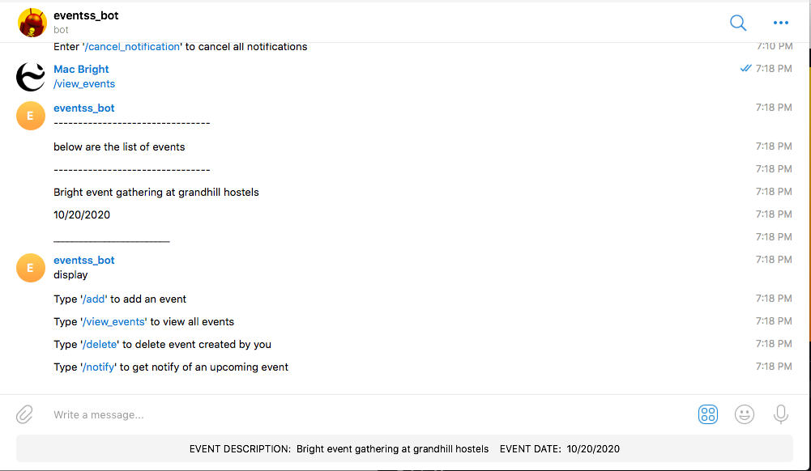

<h1 align=center> **TELEGRAM EVENT BOT ** </h1>

[](https://github.com/RichardLitt/standard-readme)
[](https://david-dm.org/dwyl/esta)


This is a Telegram Event Bot . User can  create events, delete events created by him or her, view all events from other users and also get notifications for upcoming events


#


## Background

- Ruby
- Rails
- Postgresql


## Demo
 Check out the live demo of the project. [Click](https://t.me/event_telegram_bot)

## Usage

```sh
$ git clone https://github.com/jessicafarias/Personal_bot.git event_bot
```
<br /> Clone the repository to your local machine


```sh
$ cd event_bot
```
<br /> cd into the directory


`$ bundle install` 
<br /> to install all the gems

`$ rake db:migrate` 
<br /> to migrate the database

`$ ruby telegram/event.by` 
<br /> to start the bot


<br /> open telegram and search for the bot @event_telegram_bot
<br /> bot ready for use

## Maintainers 

👤  **Bright Okike**

- Github: [@macbright](https://github.com/macbright)
- LinkedIn: [@bokike](https://www.linkedin.com/in/bokike/)
- Twitter: [@b_okike](https://twitter.com/b_okike)

## Future Features
1.  option for user to edit added events
2.  allow users create events from the web
3.  allow image upload
4. 	users get's sms notification or email notification of upcoming events 
5. 	allow users attend events and see list of other users attending


## Contributing

1. Fork it https://github.com/jessicafarias/Personal_bot.git/fork)
2. Create your feature branch (git checkout -b feature/[choose-a-name])
3. Commit your changes (git commit -am 'What this commit will fix/add')
4. Push to the branch (git push origin feature/[chosen name])
5. Create a new Pull Request

## License

Bright okike
[MIT license](https://opensource.org/licenses/MIT).